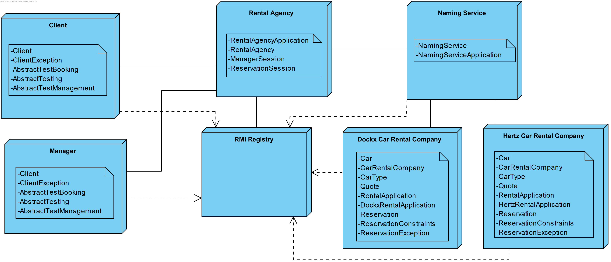
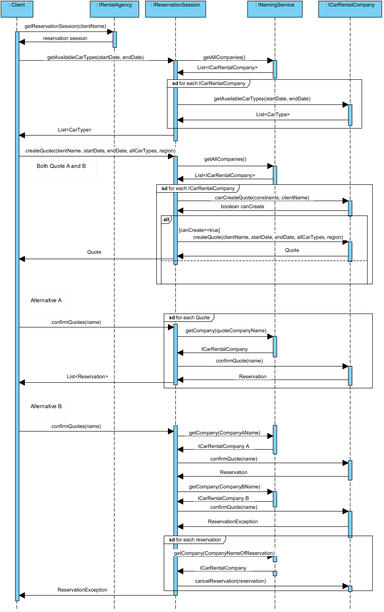

# Java RMI: Assignment 2 And 3
KULeuven Distributed Systems

**Overall score**: 18/20

**Year**: 2019-2020 Master of Science in the Applied Informatics

**Team**:
* [Dries Janse](https://github.com/r0627054)
* [Steven Ghekiere](https://github.com/StevenGhe)

# About
### Serializable Classes

When a Java class implements the java.io.Serializable interface, an instance of this class can
be passed as a result or an argument in Java RMI. These instances, just as all primitive types, are
copied and passed by value. This means that the receiver creates a copy of the object. On this
copied object, methods can be invoked but this will only change the local object. The state of the
local object can be different from the state of the original object of the sender.

Classes need to be serializable when the value of the object of such a class is needed. The
users, of these classes, are not allowed to modify the original objects. In our project, we made the
following classes explicitly serializable:

* CarType
* ReservationConstraints
* Quote
* Reservation (subclass of Quote)

The following classes, used in our project, are already serializable: String, Date, HashSet, ArrayList
and HashMap.
To illustrate this with an example: the client class can request a list of available car types.
It requests this list by invoking the getAvailableCarTypes method on the remote object reference
of his reservation session. This will return an ArrayList of car types. These types are passed by
value, this is done because the client classes are not allowed to change the information of the actual
car types.

### Remote Classes

Instances of classes which are remotely accessible (implement the java.rmi.Remote interface)
are passed by remote object reference. The object which receives this remote object reference can
make RMI calls on this remote object. Because no copy is made of the object, the original object
of the sender is modified. All the classes, which have to be remote, have to implement an interface
specifying all the methods which can be invoked remotely. This interface directly extends the
java.rmi.Remote interface and is implemented by the remote class.

In our project the following remote interfaces are created:
* INamingService
* ICarRentalCompany
* IManagerSession
* IReservationSession
* IRentalAgency

The INamingService is a remote interface used for registering, unregistering and requesting car
rental companies to the naming service. The ICarRentalCompany is a remote interface used for
requesting and manipulating car rental company data. It is used by both the reservation and
manager session. The IReservationSession is a remote interface used for creating, requesting,
confirming quotes and requesting car types. The IManagerSession is a remote interface used for
registering/unregistering car rental companies and requesting general information such as the
number of reservations, best customers and popular car types. The IRentalAgency is a remote
interface used for creating and closing sessions

### What data has to be transmitted between client and server and back when requesting the number of reservations of a specific renter?

When calling the getNumberOfReservationsByRenter method in the client class, two parameters are required: the name of the client of which the client wishes to receive the information
and a remote object reference of the IManagerSession. This IManagerSession is stored on the
RentalAgency server. On this manager session reference the client will invoke the remote getNumberOfReservations method, which needs to name of the client. This client name string will be
marshalled and send by value to the RentalAgency server where the manager session is stored. It
will first request all the car rental companies references at the naming service. The naming service
server will return all the car rental company references it contains, to the rental agency server. The
manager session does this by invoking the getCarRentalCompanies method on the naming service
reference. Thereafter, the getReservationsByRenter method is called by the manager session on
each of the car rental companies references, to calculate the total amount of reservations. Finally
the manager session stored on the rental agency server will return the total amount of reservations
of the renter back to the client by value.

### How is the naming service implemented? What role does the built-in RMI registry play?

The NamingService class is used to store all the ICarRentalCompany remote object references. It
does this by making use of a HashMap where the key is the name of the company and the value
is the remote object reference of the car rental company. By making use of this data structure a
company reference is easily accessed by its name and no duplicate companies can exist.

The NamingService class itself implements the INamingService interface. This interface extends
the java.rmi.Remote interface and contains the methods to register, unregister and request remote
car rental company object references.

To start the naming server, a NamingServiceApplication class is used. This class only contains a main method which creates an instance of the naming service, exports it as a remote object
and binds it to the RMI registry. The car rental agency can lookup this naming service on the
RMI registry.

This design is chosen because it ensures that the components are loosely coupled and have
high cohesion. This design makes it possible to run the naming service on a different server than
the car rental agency. The car rental agency only needs an identifier of the naming server so it can
lookup the remote object reference using the RMI registry.

### Approach to achieve life cycle management of sessions

All the sessions, both the manager and reservation, are stored on the rental agency. The sessions
are stored in a HashMap, with as key the name of the client and the value equals the session.
The rental agency is responsible for creating, storing and closing sessions. When the client asks
for a reservation session, the agency first tries to find an existing reservation session with a
matching client name. The agency does this for reusing sessions if they where already created.

If a session was already created, the agency will return this session, otherwise a new reservation
session will be created and stored on the agency. The same approach is used for the manager session.
For cleaning the sessions, the client explicitly invokes the closeReservationSession method on
the remote object reference of the agency as suggested in the assignment. The name of the client,
which is the same name as the session, is given as an argument to the remote procedure. The
rental agency searches the session with the matching name, and removes this session from the map.

### Why is a Java RMI application not thread-safe by default? How does your application of synchronization achieve thread-safety?

A Java RMI application is not thread-safe by default because the RMI runtime makes no guarantees
of the mapping of remote object invocations to theads. Method invocations on the same remote
object can be executed concurrently. This is why the remote object implementation needs to make
its implementation thread-safe.

To achieve synchronization in Java, there are two choices: either the synchronized tag is set
on the method declaration or the synchronized tag is set on a certain data structure. The first
option means that if the client calls this method, the server will never pause this method during
execution. The second option, which is more fine grained, ’locks’ a certain data structure for a
certain amount of statements, in which this object will never be able to be changed by another
process that wishes to do so.

We made use of synchronization in the application in the following classes:
* NamingService: in both the register and unregister methods, the companies HashMap is
synchronized.
* CarRentalCompany: the cancelReservationSession method is synchronized.
* ReservationSession: the confirmQuotes method is synchronized.
* RentalAgency: in the createNewReservationSession, createNewManagerSession, closeManagerSession and CloseReservationSession, the sessions map is synchronized.

### Scalability of Design

All the synchronization in the project is used to achieve thread-safety. For a small agency
application is does not create a bottleneck. But if the application is scaled up, there will be
bottleneck. The rental agency will become the single point of failure because this contains all the
sessions which will handle the confirmation of quotes. These quotes are confirmed in a synchronized
way. A possible solutions for this problem is to handle quote confirmation in a concurrent way, this
can be done if the list of quotes does not contain the same companies. Also the session management
can become a bottleneck for the agency because the map of sessions needs to be synchronized.

### Deployment diagram

### Sequence Diagram

